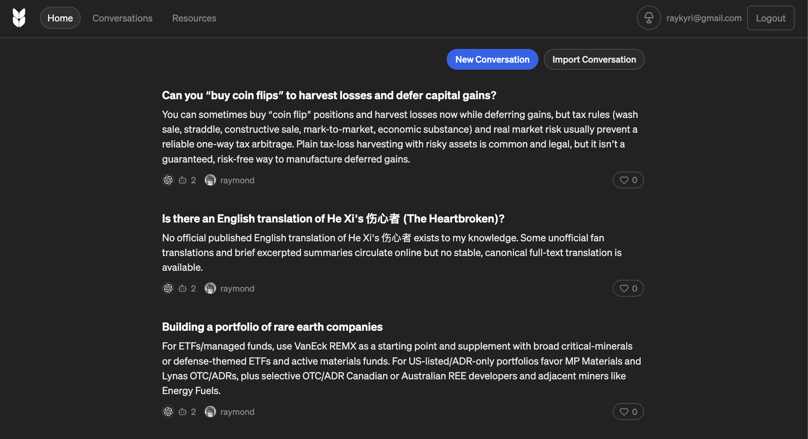

### February 25, 2026

I rewrote Braid over the last two days, to transform it from a knowledge base and agentic chat into something that looks more like a question-and-answer site. I also tuned a set of prompts to generate short summaries for a feed:

This iteration is the first one where I'm starting to consider what the platform feels like. At this point, I'm not getting much signal on whether this is useful yet (the _content_ could be compelling? hard to say).

A few issues: AI responses are too long, people already have strong habit paths around Claude/ChatGPT, the question density is too high, etc.

But I think the main problem is that the site doesn't feel right. Once people had positive associations with Quora-like websites, when Quora was high quality, but that basically ended in the early 2010s. Medium adaptation means that unprimed, neutral users will come to a piece of software with strong preconceptions, and currently those associations are against things that look like "feeds" or "platforms".

This isn't even a memes or a community problem; I notice the same kind of feedback when I see other people demo'ing applications that _look_ like social networks or other 2010s-type software.

I'm gonna fall back to the only known way to address this, which is borrowing heavily from an existing design language that's active and alive today.

Bluesky did this well in 2021 - I didn't give them enough credit at the time, but many people remarked about how it felt exactly like classic Twitter. They rolled back the design language just enough to match Twitter from about 2-3 years earlier, minus the Twitter jankiness, and people knew exactly how to use the application when it launched.

Looking back, I have also run this strategy twice before, the first time for a Yik Yak-like app in college where we had a natural A/B test because we were competing with a fork. The competing forum changed the design language because the dev wanted to rewrite everything in Ruby on Rails. Everyone was confused and went to the version of the forum that looked familiar.

The second time I used this strategy was while working on DAOs, and I led a period of heavily borrowing from Snapshot's design language. Snapshot was a widely used governance tool that served a very different niche at the time, so we were able to implement their typography and some of their visual design without stepping on their toes (and we actually ended up partnering on some work).

I haven't thought about it much in the last four years, but looking back, I do think that was one of the critical design decisions that allowed people to understand how to use our application.

At the current pace, it'll take about a day and a half to implement a new design language. Part of that design language will be condensing the length of summary responses shown to users.

After that, I plan to take a day to scaffold some information architecture (e.g. boards, tags, social graph) which should make the barebones prototype above feel more substantial. And then we'll have a much more high signal prototype, which will let us decide where to go from there.
