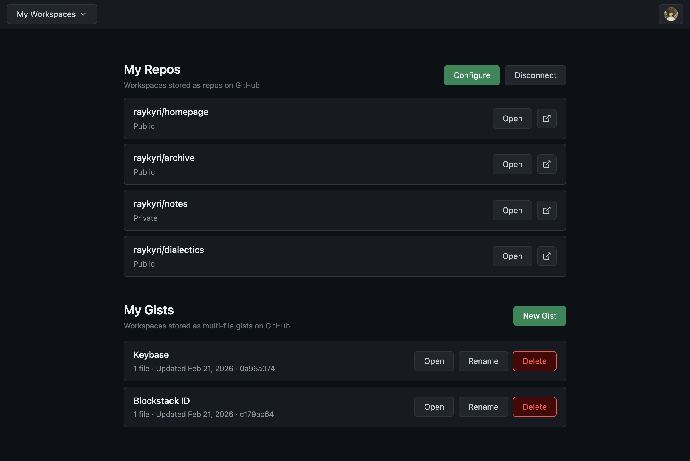
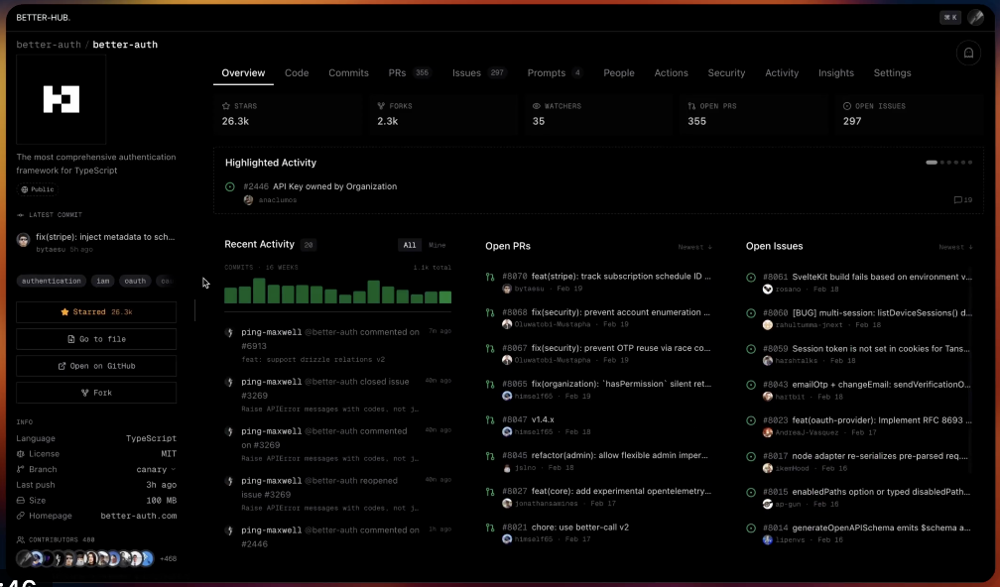
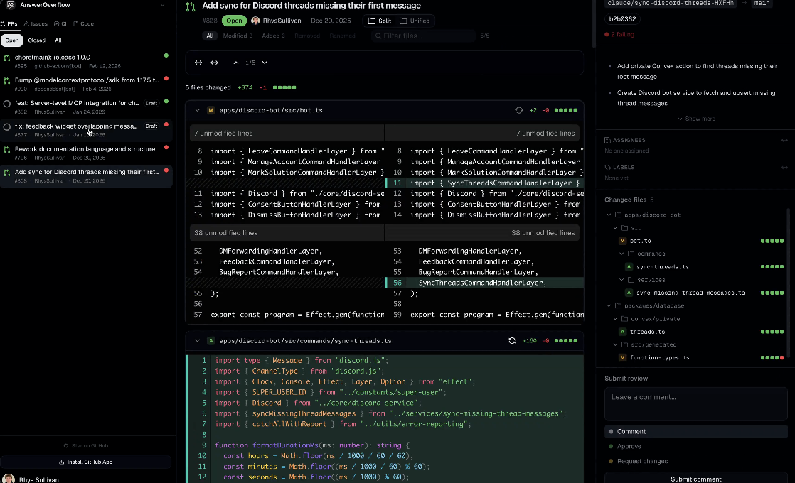

### 2026-03-02

Input is live now. It's an alternative GitHub frontend that implements some patterns I've been interested in exploring for a while.

To use it, start with any repo, and just replace github.com with input.md:

```
input.md/raykyri/homepage
```

It asks for minimal permissions (access to gists, plus repos that you authorize).

Or you can just log in, and it'll walk you through creating your first workspace.

The interface works a lot like Obsidian - it lets you edit a folder of .md files. There are a few easter eggs too - if you save a Claude Code /export .txt file, it'll render that!

If you have a repo called `homepage`, you can also access it through [your username].input.md.



Input is stateless, as far as user data is concerned. We don't persist any of your data to our own database, except for OAuth tokens and app installation tokens.

---

With Claude and Codex, it feels possible to make more applications that sit on top of existing data stores, but still have surprisingly complete functionality.

[Beka (founder of Better Auth)](https://x.com/bekacru/status/2024601263523111349) made an alternative GitHub frontend recently:



[Rhys Sullivan (of OpenCode)](https://x.com/RhysSullivan/status/2025793148321231119?referrer=grok-com) also made a GitHub frontend:



Unlike their frontends, Input doesn't try to be a better GitHub, it tries to be something totally different.

So far, it's working well for me, in that I do most of my writing here, and will do most of my experiments with AI on it as well.

Input lets me bring prototyping [[.concepts/context-of-use.md|closer to the context of use]], so I can experiment with new kinds of applications and design patterns on my own data.

### Will the real malleable software please stand up?

But why stop at Obsidian/HackMD on top of GitHub? Why not make a Linear or Asana? An entire ticketing system that can be used to run a company? A fully-featured blogging platform? An internal tools system where your applications are all stored on Git?

It's a new, yet also very old, way to build malleable software, that embraces Obsidian's file-over-app policy, to achieve the benefits of malleable software.

It's not local-first, and it's not backendless software either. The backends just cache and proxy your state to another persistent data store.
