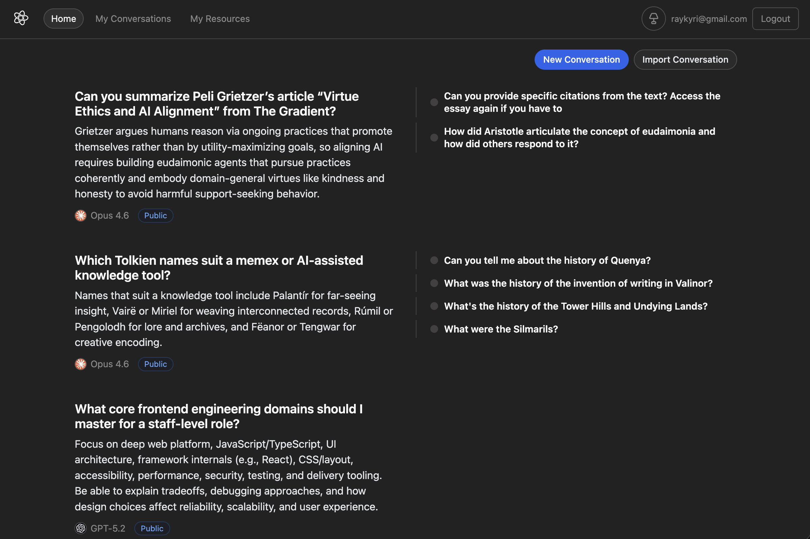
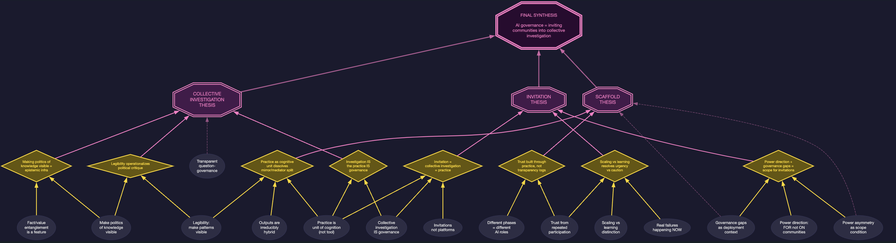

### 2026-03-04

Braid looks a little more multiversal now.

The application now uses summarization in multiple places to provide much more readable outputs.

It's not quite a [[.concepts/loom|loom]] yet, but it's a knowledge graph. I've started to use it to ask questions that I wouldn't have asked before -- branching in new directions, getting second opinions, and opening up threads that I wouldn't have started otherwise.

Two pressing concerns: AI generates a *lot* of text. We need a way to identify the good parts of answers, or otherwise distill down overwhelmingly long answers. We probably also want an original way to branch and create new questions, rather than the current design which is too similar to Quora.

### Electric Monks

One detour this week was experimenting with Kyle Mathews' [Electric Monks](https://github.com/KyleAMathews/hegelian-dialectic-skill) Claude skill. It takes a question or tension, and launches a fleet of subagents to argue for different positions related to the question. Then another subagent synthesizes them, tests them, and starts a new round, for three or four rounds in total.

This skill is in the same family of interfaces that I've been investigating: multi-user (ish) agent interfaces that simulate different perspectives and weave them together, that use AI to alternate between diverging and converging, and implement the [design double diamond](https://en.wikipedia.org/wiki/Double_Diamond_(design_process_model)).

I ran a full dialectic yesterday, with some manual intervention to push the AI towards high-quality lines of thought. Here's a visualization (diagram not mine, currently confirming with the creator for credit):

The top level question: Why hasn't there been more progress towards using AI for governance?

The dialectical pairs (note that none of these tensions try to answer the question directly):

- Should AI be a mirror that reflects collective beliefs back to groups, or a mediator that generates bridging proposals and facilitates deliberation?
- Is the goal of deploying AI to improve epistemics and get the facts right, or is governance about politics, not epistemics?
- Do we have to design carefully, or build first and learn through practice?

The synthesis after three rounds basically arrived at the concept of _practice design_: if we want to use AI for governance in a way that's impactful, we should be leading by working with communities, to design forms of use that bring people together to deploy it.

Is this an good answer? I think it's not actually immediately obvious. But it _does_ roughly match the state-of-the-art[^1] in how people in the field think about deploying AI.

The dialectic also did an excellent job of covering relevant subject matter. Our Opus 4.6 subagents surveyed a surprisingly broad swathe of references on their way to the final synthesis (about 30 distinct examples). They tested and re-tested arguments, bailed when it became clear that tensions weren't germane to a productive synthesis, and arrived at a satisfying conclusion.

There were several promising points in the middle of the dialectic where we could have branched into a sidebar based on the intermediate output alone. And if I were using AI to do further exploration, I would definitely use the final synthesis as starting context for a new research session.

The challenge is that the dialectic just reflects the user driving the system, and these steps are satisfying to me because I chose them. But I'm not too worried about that -- the steering I had to do was minimally related to the conclusion. I was actually neutral towards the choice of arguments that were staged in the dialectical steps; it was a surprise to get a final synthesis that seemed coherent and on-point!

I think further investigation would largely verify that the model was less _reflecting my own inputs back to me_, and more constructing a frame using the inputs that I had given as loose hints/constraints. I left the experiment confident that if we had more people involved in the dialectics, it would have captured their views as well.

Longer writeup to come soon.

[^1]: Citation needed, none at this time. But the claim is in line with my understanding of how practitioners across the public, social, and private sectors are thinking these days.
